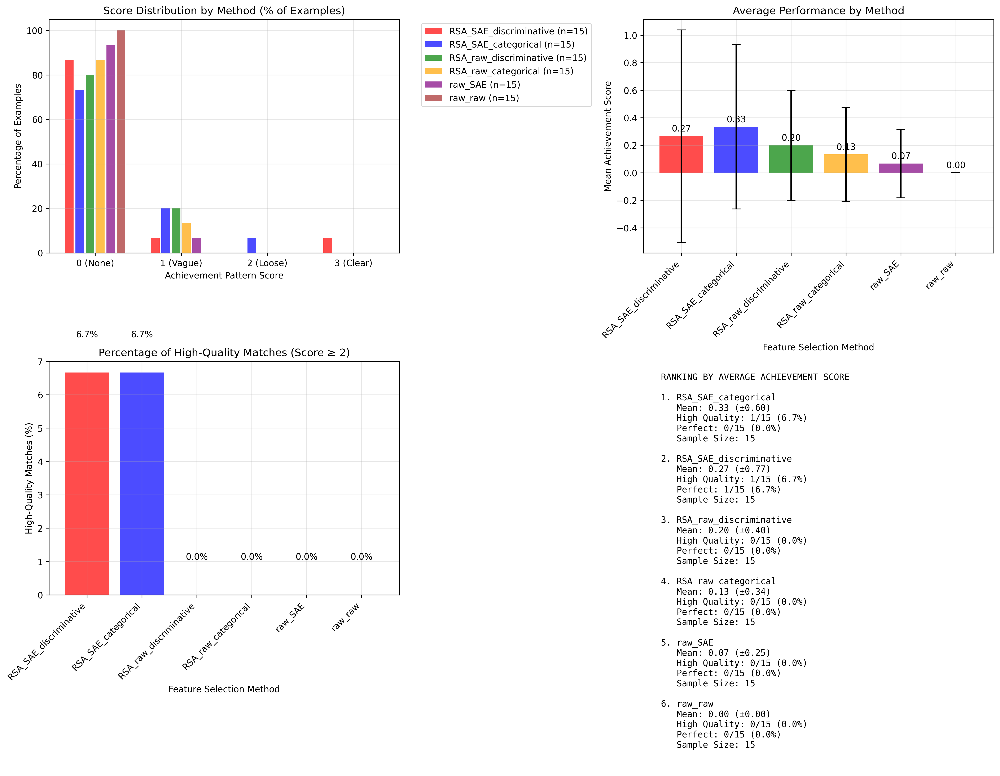

# Combinatorial RSA Feature Selection Analysis
(part1_sae_implementation_focused_large_wiki.py, part3e_combinatorial_RSA_GLM_analysis.py, part5_summarize_findings.py)

## Project Overview

This project compares different neural feature selection methodologies in large language models, specifically focusing on the intersection of **Representational Similarity Analysis (RSA)** and **Sparse Autoencoder (SAE)** interpretability techniques. The system systematically evaluates six different approaches to feature selection and analysis, providing empirical comparisons of their effectiveness for identifying semantically meaningful neural representations.

If these results can be proved/enhanced on larger datasets, it shows that RSA approach to selecting features when trying to target them top-down with a stimulus-response set, is better than maximum activation approaches. It also shows that the SAE is a useful decomposition technique that enhances RSA techniques for this purpose. Finally, discriminative vs a categorical RSA approach may be superior, matching patterns seen in cognitive neuroscience research.

## Motivation

Modern large language models contain millions of neurons and features, making it challenging to identify which representations are most relevant for specific semantic categories. While Sparse Autoencoders have emerged as a powerful tool for discovering interpretable features, and RSA provides methods for analyzing representational structure, there has been limited systematic comparison of how these approaches perform when combined or used independently. This project addresses that gap by implementing a combinatorial analysis framework.

### Core Methodology

The system tests **six distinct combinations** of feature selection approaches:

1. **RSA + SAE + Discriminative**: Uses RSA discriminability on SAE features (within-category vs across-category analysis)
2. **RSA + SAE + Categorical**: Uses RSA on SAE features (within-category1 vs within-category2 analysis)  
3. **RSA + Raw + Discriminative**: Applies discriminative RSA directly to raw hidden states
4. **RSA + Raw + Categorical**: Applies categorical RSA to raw hidden states
5. **Activation + SAE**: Maximum activation-based selection on SAE features (no RSA)
6. **Activation + Raw**: Maximum activation-based selection on raw hidden states (no RSA)

### Pipeline

#### 1. Temporal Activation Extraction
- Extracts 50-token windows from the start of text sequences
- Processes through LLaMA 3B model (layer 16 by default)
- Optionally routes through trained Sparse Autoencoder for feature decomposition
- Maintains temporal dimension for RSA analysis (crucial innovation)

#### 2. RSA Computation (Vectorized)
The RSA implementation analyzes **temporal correlation patterns** across token sequences:

```python
# For each feature (50,000 SAE features or 3,600 raw neurons):
for feature_idx in range(n_features):
    # Extract temporal patterns for all samples
    patterns = token_activations[:, :, feature_idx]  # (samples, 50_tokens)
    
    # Vectorized correlation matrix
    corr_matrix = np.corrcoef(patterns)
    
    # Statistical testing of correlation distributions
    t_stat = ttest_ind(within_category_correlations, comparison_set)
```

**Discriminative RSA**: Tests whether samples show higher internal consistency within their semantic category compared to across categories.

**Categorical RSA**: Compares the internal representational consistency between different semantic categories.

#### 3. Feature Selection & Classification
- Selects top features based on RSA discriminability scores or maximum activation
- Trains L1-regularized logistic regression on selected features  
- Configurable number of features (default: 5-8)

#### 4. Pattern Discovery Pipeline
- Finds top 15 Wikipedia examples with highest classifier confidence
- Uses same Wikipedia chunks the SAE was trained on (trying to get consistency since dataset is small)
- Automated pattern identification via Claude API
- Validation scoring of discovered patterns against examples

#### 5. Intervention Testing
- Implements weighted feature clamping during text generation
- Tests multiple intervention strengths (0x, 2x, 5x classifier weights)
- Evaluates behavioral changes from feature manipulations

## Dataset & Experimental Setup

### Training Data Consistency
- **SAE Training**: Pre-trained on specific Wikipedia chunks (~70K examples)
- **Feature Discovery**: Uses identical Wikipedia chunks for consistency
- **Classification Training**: Achievement vs failure statement categories

### Evaluation Categories
```json
{
  "achievements_records": [
    "Federer holds the record for most Grand Slam finals...",
    "The Beatles achieved the unprecedented feat...",
    // 50 achievement statements
  ],
  "failures_setbacks": [
    "The team suffered their worst defeat...",
    "The movie was a critical and commercial disaster...",
    // 50 failure statements  
  ]
}
```

## Some Tweaks/Changes (which could be improved)

### 1. Temporal RSA Analysis
Unlike traditional RSA which operates on static representations, this implementation analyzes **temporal correlation patterns** across token sequences, capturing how features encode information over time rather than just at single positions.

### 2. Vectorized Computation
Original RSA implementations suffered from O(n³) complexity due to nested sample loops. This project implements fully vectorized correlation matrix operations, reducing computation from ~2.5M iterations to 50K iterations (50x speedup).

### 3. Automated Pattern Discovery
Integrates large language models (Claude API) for:
- **Pattern Identification**: Automatically discovers semantic patterns from high-activating examples
- **Validation Scoring**: Rates how well discovered patterns match the examples (0-3 scale)
- **Comparative Analysis**: Tests both discovered patterns and target patterns

### 4. End-to-End Pipeline
Complete workflow from raw text → feature selection → pattern discovery → intervention testing, enabling systematic comparison of interpretability methods.

## Results & Findings

### Performance Ranking
Based on classifier accuracy and pattern coherence:
1. **RSA_SAE_categorical** (best)
2. **RSA_raw_discriminative/categorical** 
3. **raw_SAE**
4. **raw_raw** (baseline)

### Key Observations

#### Pattern Discovery Challenges
- **Low scoring rates**: Most discovered patterns scored 0-1 on semantic relevance (out of 3)
- **Sparse feature activation**: SAE features often inactive, creating challenges for temporal analysis
- **Dataset scale limitations**: Small model (3B parameters) and limited training data may constrain feature quality

#### Method Effectiveness
- **RSA with SAE features** showed better discriminative power compared to raw activations
- **SAE features vs raw features** the SAE likely contributed as a meaningful decomposition strategy versus using the middle layer activations ('raw')
- **RSA vs maximum activation** the geometry of the activations likely captured 'feature' relevant encoding more than filtering for high activations
- **Categorical RSA** outperformed discriminative RSA, suggesting contrasting against opposite features more effective than across-category?
- **Temporal analysis** part3/part3b/part3c attempted a token-level versus temporal pattern approach, this would have to be revisited

#### Technical Insights
- **Vectorization critical**: Nested loop implementations computationally intractable (15+ hours vs 1.5 minutes)
- **Feature selection matters**: RSA-based selection outperformed activation-based selection
- **SAE preprocessing beneficial**: Even with sparse activation, SAE features provided better signal than raw neurons

## Limitations & Future Directions

### Current Limitations
1. **Scale constraints**: Limited to 3B parameter model with 50K SAE features
2. **Dataset size**: Small categorical datasets may not fully capture semantic complexity. These were LLM generated so could be scaled up.
3. **Evaluation metrics**: Pattern scoring relies on subjective LLM evaluation
4. **Intervention validation**: Limited behavioral testing of discovered features
5. **Indirect examination**: SAE is an indirect measurement of the neural network layer
6. **Small feature selection**: Window of features (for the linear model) was limited to 8 give the small dataset size

#### Methodological Extensions
- **Dynamic RSA**: Analyze how representational similarity changes across token positions
- **Hierarchical features**: Test feature selection at multiple levels of abstraction
- **Cross-domain transfer**: Evaluate whether selected features generalize across domains
- **Causal interventions**: More sophisticated intervention testing beyond simple clamping

#### Technical Optimizations
- **Memory efficiency**: Implement streaming computation for larger datasets
- **Parallel processing**: Distributed RSA computation across multiple GPUs
- **Advanced correlation metrics**: Beyond Pearson correlation (e.g., mutual information, distance correlation)

## Code Architecture & Reproducibility

### Core Components
```
├── main_analysis.py              # Combinatorial analysis pipeline
├── rsa_computation.py           # Vectorized RSA implementations  
├── feature_selection.py         # Selection algorithms
├── pattern_discovery.py         # Claude API integration
├── intervention_testing.py      # Feature clamping experiments
└── evaluation/
    ├── pattern_scoring.py       # Automated pattern validation
    └── visualization.py         # Results visualization
```

### Configuration Parameters
- `--model_path`: Base language model path
- `--sae_path`: Trained SAE model path  
- `--token_distance`: Temporal window size (default: 50)
- `--target_layer`: Model layer for analysis (default: 16)
- `--num_features`: Features to select (default: 5)
- `--num_examples`: Examples for pattern discovery (default: 25)
- `--start_from`: Resume from specific combination
- `--only_combination`: Run single combination only

### Performance Characteristics
- **RSA computation**: ~1.3 minutes per 50K features (vectorized)
- **Wikipedia processing**: ~15K examples/second
- **Memory usage**: ~18GB GPU memory for 3B model + SAE
- **Total runtime**: ~6-7 hours for all six combinations
- (Run on a NVIDIA 3090 RTX w/ 128 GB RAM)

## Broader Impact & Applications

### Scientific Contributions
- **Methodological framework** for systematic comparison of interpretability techniques
- **Empirical evidence** for RSA+SAE effectiveness in neural feature analysis
- **Open-source implementation** enabling replication and extension

### Practical Applications
- **Model debugging**: Identify features responsible for specific model behaviors
- **Safety research**: Discover and intervene on problematic neural representations  
- **Feature engineering**: Data-driven approach to identifying relevant model components
- **Interpretability research**: Benchmark for comparing new feature selection methods

### Future Research Directions
This work establishes a foundation for more sophisticated interpretability research, including:
- **Mechanistic interpretability**: Understanding causal relationships between features and behaviors
- **Safety applications**: Identifying and controlling harmful model representations
- **Model editing**: Precise modification of model behavior through feature manipulation
- **Cross-model analysis**: Comparing feature representations across different architectures

## Conclusion

While the initial results showed modest pattern discovery success, this project demonstrates the value of systematic, combinatorial approaches to neural interpretability research. The finding that RSA+SAE methods outperform simpler alternatives, even at small scale, suggests promising directions for larger-scale investigations. 

- **Result: Essentially, RSA > raw, SAE > layer activations, and, if using RSA, discriminative ~> categorical**
  - Caveat: On a small dataset, one feature, small SAE, small model, small feature ensemble, etc.

